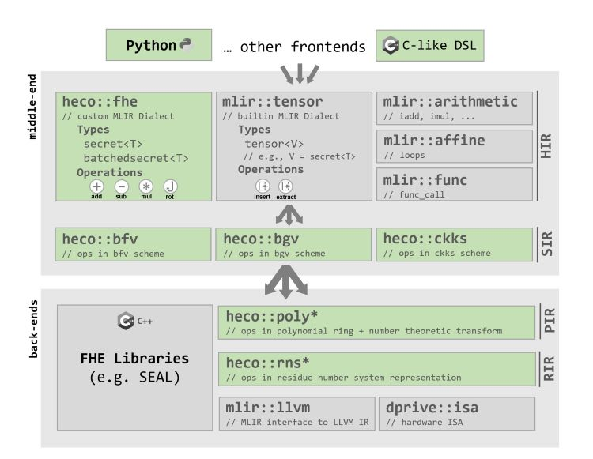

> **Note**
> Welcome to the Artifact Evaluation version of HECO!   

HECO is an end-to-end compiler for FHE that takes high-level imperative programs and emits efficient and secure FHE implementations.
Currently, it supports Ring-LWE based schemes [B](https://eprint.iacr.org/2012/078)/[FV](https://eprint.iacr.org/2012/144), [BGV](https://eprint.iacr.org/2011/277) and [CKKS](https://eprint.iacr.org/2016/421) which offer powerful SIMD-like operations and can _batch_ many thousands of values into a single vector-like ciphertext.

- [About HECO](#about-heco)
- [Using HECO](#using-heco)
  - [Modes](#modes)
    - [Interactive Mode](#interactive-mode)
    - [Transpiler Mode](#transpiler-mode)
    - [Compiler Mode](#compiler-mode)
- [Installation](#installation)
  - [Prerequisites](#prerequisites)
  - [Dependencies](#dependencies)
  - [Building](#building)
- [Development](#development)
  - [Development Environemnt](#development-environemnt)
  - [Repository's Structure](#repositorys-structure)
  - [Development Tips for working with MLIR-based Projects](#development-tips-for-working-with-mlir-based-projects)
    - [Working with TableGen](#working-with-tablegen)
    - [Debugging MLIR](#debugging-mlir)


# About HECO
In FHE (and other advanced cryptographic techniques such as MPC or ZKP), developers must express their applications as an (arithmetic/binary) circuit. Translating a function *f* so that the resulting circuit can be evaluated efficiently is highly non-trivial and doing so manually requires significant expert knowledge. This is where FHE compilers like HECO come in, by automating the transformation of high-level programs into lower-level representations that can be evaluated using FHE.

HECO's design and novel optimizations are described in the accompanying [paper](https://arxiv.org/abs/2202.01649).
In contrast to previous compilers, HECO removes a significant burden from the developer by automating the task of translating a program to the restricted SIMD programming paradigm available in FHE. This can result in speeupds by over an order of magnitude (i.e., 10x or more) when compared to a naive baseline.

HECO is built using the [MLIR](https://mlir.llvm.org/) compiler framework and follows a traditional front-, middle- and back-end architecture. It uses two Intermediate Representations (IRs) in the middle-end, High-level IR (HIR) to express programs containing control flow and an abstraction of FHE computing (`heco::fhe`). 
This is then lowered to Scheme-specific IR (SIR), with operations corresponding to the FHE schemes' underlying operations (e.g., addition, multiplication, relineraization, etc.). Currently, HECO targets [Microsoft SEAL](https://github.com/Microsoft/SEAL) as its backend. In the future, HECO will be extended with Polynomial-level IR (PIR) and RNS IR (RIR) to directly target hardware (both CPUs and dedicated FHE accelerators).



# Using HECO

## Python Frontend

> **Note**
> HECO's original Python Frontend has been deprecated in favour of using the upcoming [xDSL](https://github.com/xdslproject/xdsl) frontend system.
> We are working on extending the frontend with more functionality and completing the toolchain, such that frontend programs can be executed again.

## Modes
HECO can be used in three distinct modes, each of which target different user needs.

### Transpiler Mode
In transpiler mode, HECO outputs a `*.cpp` source file that can be inspected or modified before compiling & linking against SEAL. HECO performs the usual high-level optimizations and lowers the program to the Scheme-specific Intermediate Representation (SIR). This is then lowered to the MLIR `emitC` Dialect, with FHE operations translated to function calls to a SEAL wrapper. The resulting IR is then translated into an actual `*.cpp` file.

Transpiler mode is designed for advanced users that want to integrate the output into larger, existing software projects and/or modify the compiled code to better match their requirements.

> In order to use the transpiler mode, you need to modify the default compilation pipeline (assuming you are starting with an `*.mlir` file containing HIR, this would be `heco --full-pass [filename_in].mlir`) in two ways. 
>  1. Specify the scheme (and some core parameters) to be used by adding, e.g., `--fhe2bfv=poly_mod_degree=1024` and the corresponding lowering to emitC, e.g., `--bfv2emitc`, each followed by `--canonicalize` and `--cse` to clean up redundant operations introduced by the lowering.
>  2. Translate to an actual `*.cpp` file by passing the output through  `emitc-translate` 
>
> A full example might look like this:  `heco --hir-pass --fhe2bfv=poly_mod_degree=1024 --canonicalize --cse --bfv2emitc --canonicalize --cse [filename_in].mlir > emitc-translate --mlir-to-cpp > [filename_out].cpp`.
>
> In order to compile the file, you will need to include [`wrapper.cpp.inc`](test/IR/BFV/wrapper.cpp.inc) into the file and link it against SEAL (see [`CMakeLists.txt`](test/IR/BFV/CMakeLists.txt)).  Note that the current wrapper assumes (for slightly obscure reasons) that the generated code is inside a function  `seal::Ciphertext trace()`. If this was not the case for your input, you might need to adjust the wrapper. By default, it currently serializes the result of the function into a file `trace.ctxt`.

### Interactive Mode
In  interactive mode, an interpreter consumes both the input data and the intermediate representation. HECO performs the usual high-level optimizations and lowers the program to 
the Scheme-specific Intermediate Representation (SIR).
This is then executed by the interpreter by calling suitable functions in SEAL.

This mode is designed to be easy-to-use and to allow rapid prototyping. While there is a performance overhead due to the interpreted nature of this mode, it should be insignificant in the context of FHE computations.

> **Note**
> Interactive mode will become available when the new Python frontend is finished.

### Compiler Mode
In compiler mode, HECO outputs an exectuable. In this mode, HECO performs the usual high-level optimizations and lowers the program to the Scheme-specific Intermediate Representation (SIR). This is then lowered to LLVM IR representing function calls to SEAL's C API, which is then compiled and linked against SEAL.

Compiler mode assumes that the input to HECO is a complete program, e.g., has a valid `main()` function. As a result, any input/output behaviour must be realized through the `LoadCiphertext`/`SaveCiphertext` operations in the scheme-specific IR.

Compiler mode is designed primarily for situations where HECO-compiled applications will be automatically deployed without developer interaction, such as in continous integration or other automated tooling.

> **Note**
> Compiler mode is not yet implemented. If you require an executable, please use Transpiler mode and subsequent manual compilation & linking for now.

# Installation
HECO uses CMake as its build system for its C++ components and follows MLIR/LLVM conventions.

## Prerequisites

Install `cmake` and `clang`. In addition, you will need `lld` and `ninja` in order to compile the MLIR framework.
On Ubuntu, this can be done by running the following:

```sh
sudo apt-get install cmake clang lld ninja-build
```

If the version of `cmake` provided by your package manager is too old (<3.20), you might need to [manually install](https://askubuntu.com/a/976700) a newer version.


## Dependencies

HECO includes two dependencies (the [Microsoft SEAL](https://github.com/microsoft/seal) FHE library, and the [MLIR](https://mlir.llvm.org/) compiler framework) as git submodules, which you need to initialize after cloning:
```sh
git submodule update --init --recursive
```

For normal use and evaluation, build MLIR and SEAL in Release Mode:  
<details>
<summary>Unfold this to see instructions for developer friendly installation instead!</summary>

>The following is a reasonable start for a "Developer Friendly" installation of MLIR.  
>Note that it uses [`ccache`](https://ccache.dev/) in order to speed up follow-up compilations, and it is highly recommended to install and set up [`ccache`](https://ccache.dev/) as it can save significant time when re-compiling.
>It also uses the [`mold`](https://github.com/rui314/mold) linker instead of `lld` as the former provides a significant performance boost.
>```sh
>mkdir dependencies/llvm-project/build
>
>cd dependencies/llvm-project/build
>
>cmake -G Ninja ../llvm \
>  -DLLVM_ENABLE_PROJECTS=mlir \
>  -DLLVM_BUILD_EXAMPLES=OFF \
>  -DLLVM_TARGETS_TO_BUILD=X86 \
>  -DCMAKE_BUILD_TYPE=Debug \
>  -DLLVM_ENABLE_ASSERTIONS=ON \
>  -DCMAKE_C_COMPILER=clang \
>  -DCMAKE_CXX_COMPILER=clang++ \
>  -DCMAKE_EXE_LINKER_FLAGS_INIT="-fuse-ld=mold" \
>  -DCMAKE_MODULE_LINKER_FLAGS_INIT="-fuse-ld=mold" \
>  -DCMAKE_SHARED_LINKER_FLAGS_INIT="-fuse-ld=mold" \
>  -DLLVM_CCACHE_BUILD=ON \
>  -DLLVM_INSTALL_UTILS=ON \
>  -DMLIR_INCLUDE_INTEGRATION_TESTS=ON
>
>cmake --build . --target check-mlir
>
>cd ../../seal
>
>cmake -S . -B build
>cmake --build build
>sudo cmake --install build
>
> cd ../..
>```
</details>


```sh
mkdir dependencies/llvm-project/build

cd dependencies/llvm-project/build 

cmake -G Ninja ../llvm \
-DLLVM_ENABLE_PROJECTS=mlir \
-DLLVM_BUILD_EXAMPLES=OFF \
-DLLVM_TARGETS_TO_BUILD=X86 \
-DCMAKE_BUILD_TYPE=Release \
-DLLVM_ENABLE_ASSERTIONS=OFF \
-DCMAKE_C_COMPILER=clang \
-DCMAKE_CXX_COMPILER=clang++ \
-DLLVM_ENABLE_LLD=ON \
-DLLVM_CCACHE_BUILD=OFF \
-DLLVM_INSTALL_UTILS=ON \
-DMLIR_INCLUDE_INTEGRATION_TESTS=OFF

cmake --build . --target check-mlir 

cd ../../seal

cmake -S . -B build
cmake --build build
sudo cmake --install build

cd ../..
```

## Building

This setup assumes that you have built MLIR as described above. To build, run the following from the repository root:
<details>
<summary>Unfold this to see instructions for developer friendly build instead!</summary>

>
>This builds in Debug mode and uses [`ccache`](https://ccache.dev/) and [`mold`](https://github.com/rui314/mold) to speed up compilation.
>```sh
>mkdir build
>cmake -S . -B build -DCMAKE_BUILD_TYPE=Debug \
>    -DCMAKE_C_COMPILER=clang \
>    -DCMAKE_CXX_COMPILER=clang++ \
>    -DCMAKE_EXE_LINKER_FLAGS_INIT="-fuse-ld=mold" \
>    -DCMAKE_MODULE_LINKER_FLAGS_INIT="-fuse-ld=mold" \
>    -DCMAKE_SHARED_LINKER_FLAGS_INIT="-fuse-ld=mold" \
>    -DMLIR_DIR=dependencies/llvm-project/build/lib/cmake/mlir
>cmake --build build --target heco
>```
</details>

```sh
mkdir build
cmake -S . -B build -DMLIR_DIR=dependencies/llvm-project/build/lib/cmake/mlir 
cmake --build build --target heco
```
To build the documentation from the TableGen description of the dialect operations, run
```sh
cmake --build build --target mlir-doc
```
Alternatively, you can open this folder in vscode. You will want to build the `check-heco` target if you want to run the tests, or the `heco` target if you just want to build the command-line compiler.

# Development
 Please see MLIR's [Getting Started](https://mlir.llvm.org/getting_started/) for more details on MLIR/LLVM conventions.

## Development Environemnt
[Visual Studio Code](https://code.visualstudio.com/) is recommended. Remember to set the `-DMLIR_DIR=...` and `-DLLVM_EXTERNAL_LIT=..` options in "Settings &rarr; Workspace &rarr; Cmake: Configure Args".
The [LLVM TableGen](https://marketplace.visualstudio.com/items?itemName=jakob-erzar.llvm-tablegen) plugin provides syntax highlighting for `*.td` files, which are used to define Dialects, Types, Operations and Rewrite Rules.
The [MLIR](https://marketplace.visualstudio.com/items?itemName=llvm-vs-code-extensions.vscode-mlir) plugin provides syntax highlighting for `*.mlir` files, which are MLIR programs in textual representation.

## Repository's Structure

The repository is organized as follow:

```
cmake           - configuration files for the CMake build system
dependencies    - git submodules for SEAL and MLIR
docs            - additional files for Documentation
include         – header (.h) and TableGen (.td) files
 └ IR             – contains the different dialect definitions
 └ Passes         – contains the definitions of the different transformations
src             – source files (.cpp)
 └ IR             – implementations of additional dialect-specific functionality
 └ Passes         – implementations of the different transformations
 └ tools          – sources for the main commandline interface
test            – test & evaluation code
```


## Development Tips for working with MLIR-based Projects
[MLIR](https://mlir.llvm.org/) is an incredibly powerful tool and makes developing optimizing compilers significantly easier. 
However, it is not necessarily an easy-to-pick-up tool, e.g., documentation for the rapdily evolving framework is not yet sufficient in many places.
This short section cannot replace a thorough familiarization with the [MLIR Guide](https://mlir.llvm.org/getting_started/).
Instead, it provides high-level summarizes to provide context to the existing documentation. 
See [test/readme.md](test/readme.md) for information on the MLIR/LLVM testing infrastructure.


### Working with TableGen
This project uses the [Operation Definition Specification](https://mlir.llvm.org/docs/OpDefinitions/) and [Table-driven Declarative Rewrite Rules](https://mlir.llvm.org/docs/DeclarativeRewrites/)
which use LLVM's [TableGen](https://llvm.org/docs/TableGen/index.html) language/tool.
This project specifies things in `*.td` files, which are parsed by TableGen and processed by the [mlir-tblgen](https://llvm.org/docs/CommandGuide/mlir-tblgen.html) backend.
The backend generates `C++` files (headers/sources, as appropriate),
which are then included (using standard `#include`) into the headers/sources in this project.
These generation steps are triggered automatically during build through custom CMake commands.

In order to debug issues stemming from TableGen, it is important to realize that there are **four different types of TableGen failures**:
* The TableGen parser throws an error like `error: expected ')' in dag init`. 
  This implies a syntax error in the `*.td` file, e.g., missing comma or parenthesis.
  These errors are presented the same as the next kind, but can be recognized since they usually mention "dag", "init" and/or "node". 
* The MLIR TableGen backend throws an error like `error: cannot bind symbol twice`. These are semantic/logical errors in your `*.td` file, or hint at missing features in the backend.
  Instead of stopping on an error, the backend might also crash with a stack dump. Scroll right to see if this is due to an assert being triggered.
  This usually indicates a bug in the backend, rather than in your code (at the very least, that an `assert` should be replaced by a `llvm::PrintFatalError`).
* The C++ compilation fails with an error in the generated `*.h.inc` or `*.cpp.inc` file. 
  This can be caused by either user error, e.g., when trying to do a rewrite that doesn't respect return types,
  or it can also be a sign of a bug in the MLIR TableGen backend.
* The project builds, but crashes during runtime. Again, this can be an indication of a backend bug or user error.

### Debugging MLIR
[//]: # (TODO Documentation: Write up how to get useful debug info out of passes)

Useful command line options for `mlir-opt`/`heco` (see also [MLIR Debugging Tips](https://mlir.llvm.org/getting_started/Debugging/) and [IR Printing](https://mlir.llvm.org/docs/PassManagement/#ir-printing)):
 * `--mlir-print-ir-before-all` - Prints the IR before each pass
 * `--debug-only=dialect-conversion` - Prints some very useful information on passes and rules being applied
 * `--verify-each=0` - Turns off the verifier, allowing one to see what the (invalid) IR looks like
 * `--allow-unregistered-dialect` - Makes parser accept unknown operations (only works if they are in generic form!)
