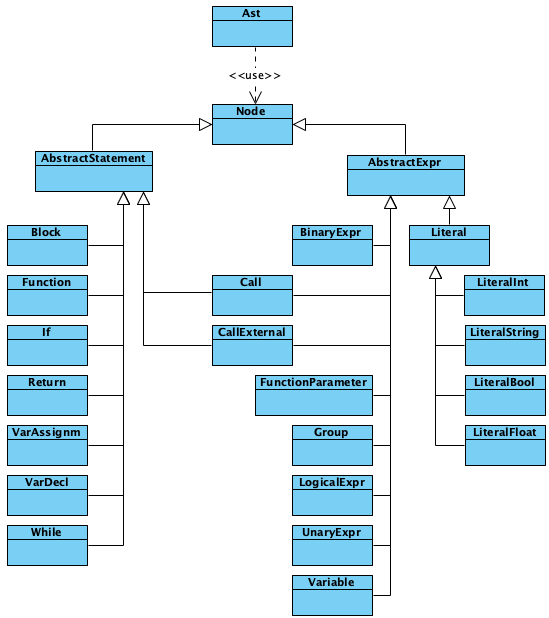

# FHE Code Optimizer

This repository hosts an optimizer for Fully Homomorphic Encryption (FHE) working based on an AST-like (Abstract Syntax Tree) representation of a program.
As future work, this optimization component should be integrated into the [Marble](https://github.com/MarbleHE/Marble) FHE compiler.

## Optimizations

The optimizations this tool aims to support can be divided into the following two groups:

**1. AST-to-Circuit Transformations.** These transformations take an AST that is constructed manually or derived from code, and then transforms the AST into a circuit by transforming non-compatible operations (e.g., If- and While-Statements) into circuit-compatible gates.

**2. Circuit-to-Circuit Transformations.** These transformations take a Circuit as input and transform it into an equivalent optimized circuit that allows performing FHE computations more efficiently. For example, by rewriting the circuit to reduce the multiplicative depth. This allows using smaller parameters that, in turn, enable more efficient computation.

// TODO Describe optimizations that are currently supported more in detail.

## AST Representation

The AST to be used as a foundation for FHE optimizations consists of nodes that are derived from either `AbstractExpr` or `AbstractStatement`, depending on whether the operation is an expression or a statement, respectively. Note that `Call` and `CallExternal` are special nodes/operations as they can either be used as an expression (e.g., in an assignment `int z = computeZ();`) or as a statement (e.g., `updateVarZ();`). A UML showing the inheritance hierarchy is given in Fig. 1. 

 <br />
***Figure 1:*** Class hierarchy of the AST classes. 

Following, the different node types are briefly explained. The examples in brackets show how the commands would look like in "plain" C++.

- Classes derived from `AbstractExpr`
    - `BinaryExpr` – a binary arithmetic expression (e.g., `13 + 37`).
    - `Call` – a call to an internal function, i.e., its implementation is represented in the AST.
    - `CallExternal` – a call to an external function which is treated as *black box*, i.e., without accessibility to its definition.
    - `FunctionParameter` – describes the parameters that a function accepts. To evaluate an AST, values must be passed for each of the parameter defined by the function's `FunctionParameter` node.
    - `Group` – represents the brackets `(` and `)`, for example, used in a binary expression (e.g., `4 + (2 * 3)`).
    - `Literal` – base class for all Literals derived from.
    - `LiteralBool` – models a Boolean value.
    - `LiteralInt` – models an integer value.
    - `LiteralString` – models an string value.
    - `LiteralFloat` – models a float value.
    - `LogicalExpr` – a (binary) logical expression using a logical operator (e.g., `z < 42`).
    - `UnaryExpr` – a unary expression (e.g., `!b` where `b` is a Boolean).
    - `Variable` – a variable identified by an identifier (name).
- Classes derived from `AbstractStatement`
    - `Block` – a code block `{...}`, e.g., the then-clause of an if statement.
    - `Function` – a function definition.
    - `If` – an if-conditional statement including both a then-branch and an else-branch  (e.g., `if (condition) { ... } else { ... }`), or either only a then-branch.
    - `Return` – a return statement of a method (e.g., `return ).
    - `VarAssignm` – the assignment of a variable.
    - `VarDecl` – a variable declaration (e.g., `Z)
    - `While` – a while-loop (e.g., `while (condition) {...}`).
    - `Call` – *see above.*
    - `CallExternal` –  *see above.*
    - `Return` – a return statement of a method, i.e., the output of a computation.

As an example, the AST generated by the demo (method `generateDemoTwo`) is depicted following:

```
Function: determineSuitableX
  FunctionParameter: (encryptedA : int)
  FunctionParameter: (encryptedB : int)
  VarDecl: (randInt : int)
	BinaryExpr: 
	  CallExternal: (std::rand)
	  Operator: (mod)
	  LiteralInt: (42)
  VarDecl: (b : bool)
	LogicalExpr: 
	  Variable: (encryptedA)
	  Operator: (<)
	  LiteralInt: (2)
  VarDecl: (sum : int)
	LiteralInt: (0)
  While: 
	LogicalExpr: 
	  LogicalExpr: 
		Variable: (randInt)
		Operator: (>=)
		LiteralInt: (0)
	  Operator: (AND)
	  LogicalExpr: 
		UnaryExpr: 
		  Operator: (!)
		  Variable: (b)
		Operator: (!=)
		LiteralBool: (true)
	Block: 
	  VarAssignm: (sum)
		BinaryExpr: 
		  Variable: (sum)
		  Operator: (add)
		  Variable: (encryptedB)
	  VarAssignm: (randInt)
		BinaryExpr: 
		  Variable: (randInt)
		  Operator: (sub)
		  LiteralInt: (1)
  VarDecl: (outStr : string)
	LiteralString: (Computation finished!)
  CallExternal: (printf)
	FunctionParameter: (outStr : string)
  Return: 
	Variable: (sum)
```

## Getting Started

Before starting, make sure to clone this repository using: `git clone https://github.com/pjattke/msc-thesis-code-AST.git`

The following tools are required to get this project running:
- cmake (version ≥ 3.15) to build the project
    - tested with v3.15.5
- gcc or clang to compile the sources
    - tested with Apple clang v11.0.0
- doxygen to build the documentation files (html)
    - tested with v1.8.16

The easiest way to use this library is to import the project into [CLion](https://www.jetbrains.com/clion/) which automatically loads the containing cmake build files and adds the respective targets. Development was carried out on macO (10.15.2), although the project should be running on Windows or Linux machines too.

Examples showing how to use this library can be found in the directory [examples](examples).

## Extending the Library

### Code Style

The code is written in C++ and formatted according to the [Google C++ Style Guide](https://google.github.io/styleguide/cppguide.html). Classes are divided into implementation and header. For example, the package `ast` is divided into:

```
include/ast     – contains the header files (.h)
src/ast         – contains the implementation (.cpp)
```

For auto-formatting in the CLion IDE, please use the code style definition provided in [doc/clion/codeStyleConfig.xml](doc/clion/codestyle) that is derived from the presets based on Google's style guide. The file can be loaded in the CLion preferences (Editor → Code Style → C/C++).

// TODO Add description on used code inspections (CLion code inspector + cpplint) and provide configuration files

#### Documentation

[Doxygen](http://www.doxygen.nl/manual/index.html) comments are used to create a documentation of this library. 
The documentation can be generated using the supplied configuration `doxygen.conf` as described following:

```bash
cd doc/doxygen
doxygen doxygen.conf
```

### Testing

The code is covered by unit tests to achieve high code quality and avoid introducing errors while extending the library.
For that, the [Google Test]() framework is used.
The library (as well as any other dependencies) is automatically cloned from its GitHub repository using cmake, see [CMakeLists.txt](test/CMakeLists.txt).

The tests can be found in the [`test`](test) directory.


